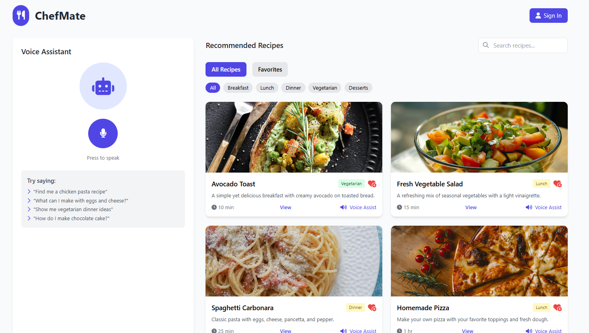

# ChefMate

ChefMate is a hands-free, intelligent cooking assistant that enhances the recipe experience through natural, multimodal interaction. Instead of relying on mouse clicks or touchscreen taps, users interact using voice commands and hand gestures, making the interface more intuitive, accessible, and responsive to real cooking conditions.

ChefMate guides users step-by-step through recipes, listens and responds to natural questions (such as “What do I need for this recipe?” or “How much salt?”), and can even generate new recipe suggestions tailored to user constraints and preferences—such as dietary requirements, number of servings, or preferred ingredients.

This integration of voice, vision, and AI-based understanding sets ChefMate apart from traditional recipe apps and makes it a suitable candidate for the next generation of user interfaces.



## Target user

ChefMate is designed to assist a broad yet clearly defined range of users who face friction when interacting with conventional cooking applications. The project specifically focuses on three core user groups: home cooks, professional chefs, and disabled persons. Each group brings unique interaction needs, which ChefMate addresses through multimodal input and a hands-free experience.

- **Home cooks** — including individuals or families preparing everyday meals, often have their hands full or unclean. ChefMate allows them to interact with recipes without needing to touch their device.
- **Chefs and culinary professionals** — who may seek inspiration or want a guided walkthrough in high-paced environments, benefit from quick voice queries and gesture-based navigation without breaking their workflow.
- **Disabled persons** — particularly those with motor limitations or reduced dexterity, are empowered through voice control and gesture recognition, reducing reliance on touchscreens and enabling greater independence in the kitchen.

# Combination of Technologies

 The idea behind ChefMate was to combine a range of existing technologies in a way that supports a more fluid, coversational, and context-aware interaction. Instead of offering a static      recipe platform, the goal was to build a dynamic assistant that could adapt to the user’s pace, respond to interruptions, and repeat or modify its guidance dependingn the chosen mode of     interaction, whether voice or gesture. This integration was designed to improve the usability of recipe navigation, especially in hands-busy cooking environments.

 - **Voice-guided cooking** — using the Web Speech API, with real-time speech synthesis and feedback.
 - **Gesture-based navigation** — powered by MediaPipe, enabling users to raise a finger to go to the next step, use a peace sign to repeat, or show a thumbs-up to go back.
 - **AI-generated recipes** —  based on natural queries such as “Make a healthy lunch with chickpeas for two people.”
 - **Fallback assistant** — based on a local Flask server with predefined recipes, ensuring resilience when AI services are temporarily unavailable.

## System Setup and Execution

ChefMate is composed of three main components that must be launched independently:  
1. The **frontend interface**  
2. The **Flask fallback backend**  
3. The **FastAPI backend** powering the AI features  

The following instructions explain how to install and run each part locally.

---

### Flask Backend (Fallback Recipes)

The fallback backend is implemented in **Flask** and provides hardcoded recipe data along with basic API endpoints.

**Steps to run:**

1. Navigate to the directory containing `app.py`:
   ```sh
   cd voice

2. Run the Backend
   ```sh
    python app.py
3. This will start the server on port

### Frontend Interface (React + Tailwind CSS)

 The user interface is built with React and styled using Tailwind CSS. It supports voice and gesture input and runs in development mode using Vite.

**Steps to run:**

1.  Navigate to the frontend folder:
    ```sh
    cd voice-recipe-assistent

2. Install dependencies (only required once):
   ```sh
    npm install

3. Start the development server:
   ```sh
    npm run dev


### FastAPI Backend (AI-Powered Assistant)

The FastAPI server powers the intelligent backend, including Whisper speech recognition, LLM-driven recipe customization, and external API integration (Spoonacular). The steps below describe how to set it up.

1. Activate Virtual Environment
2. Install dependencies (requirements.txt)
3. Run the server
   ```sh
     uvicorn api:app_fastapi--host 0.0.0.0--port 8000--reload

## Usage Instructions

Once all components are running, the application is ready to use. Users can open the frontend in a browser and interact with the system through the following modes:

### • Voice Mode
Activate the assistant while viewing a recipe and issue natural language queries such as:
- “What are the ingredients?”
- “How much salt do I need?”
- “What’s the next step?”

The assistant responds using text-to-speech and displays information on the screen.

### • Gesture Mode
Enable the webcam and use hand gestures—such as raising an index finger or showing a peace sign—to navigate through recipe steps completely hands-free.

### • AI Queries
Users can type custom queries to generate new recipes or modify existing ones.  
Examples include:
- Dietary constraints  
- Ingredient preferences  
- Number of servings  

These queries are processed through the FastAPI backend powered by the LLM.

### • Fallback Mode
If the AI backend is not running, the system automatically switches to a more limited assistant served by the Flask fallback backend.

---

Users can also browse available recipes, filter them by category, search by keywords, and save favorites.  
All state is managed locally in the browser—**no user registration or authentication is required**.
